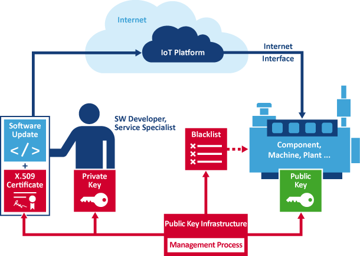
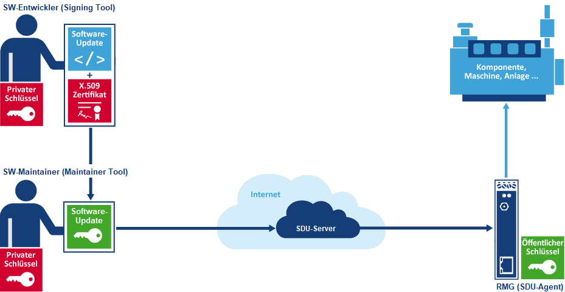

# Secure Device Update (SDU)

Betrachtet man eine typische Steuerungslösung in der Automatisierung aus dem Blickwinkel der IT-Sicherheit, müssten eigentlich sehr viele Lösungen sofort stillgelegt werden. Hauptgrund sind in der Regel fehlende Möglichkeiten für Software-Updates. In den meisten Fällen existieren noch nicht einmal Patches, obwohl einige Steuerungen seit langem bekannte Schwachstellen besitzen.

Secure Device Updates (SDU) lösen diese Probleme und bieten darüber hinaus die Möglichkeit, neue Funktionen an die Anwender zu verteilen. Soll eine Komponente, Maschine oder Anlage über eine IoT-Anbindung mit Software- und Konfigurations-Updates versorgt werden, muss neben der Anlagen- vor allen Dingen auch die IT-Sicherheit beachtet werden.

Beim aktuellen Stand der Technik erfordert dies eine Public-Key-Infrastruktur (PKI) für digitale Signaturen mit privaten und öffentlichen Schlüsseln, Zertifikaten, Sperrlisten usw., um zumindest die Authentizität und Integrität des Updates zu gewährleisten. Alle dafür erforderlichen Bausteine sind in SDU enthalten.

- [SDU Server](sdu-server.md): Hostet und verteilt Software über eine [SDU REST API](https://github.com/SSV-embedded/SDU-API)

- [SDU Signing Tool](sdu-signing-tool.md): Signiert Software und verpackt diese zu einem SDU-Archive mit Metadaten.

- [SDU Management Tool](sdu-maintainer-tool.md): Hochladen der SDU Archive auf den Server und verwalten der Versionsverteilung.

- [SDU GUC](sdu-guc.md): Gateway Update Client (GUC) ist ein Dienst auf dem SSV RMG (Remote Maintenance Gateway) welcher die zugewiesene Software vom Server herunterlädt die Signatur überprüft und die Software an den [SDU Agenten](sdu-agent.md) übergibt.

- [SDU Agent](sdu-agent.md): Ein Agent in dem RMG (Remote Maintenance Gateway) welcher den Software Update der Komponente/Maschine/Anlage durchführt.
