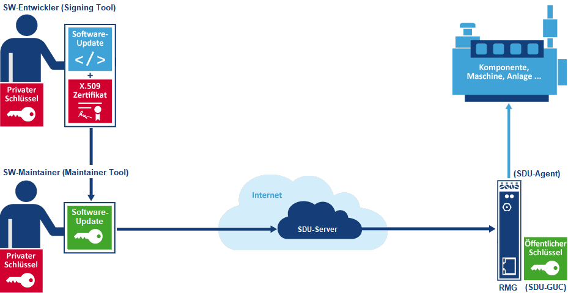

# Secure Device Update (SDU)

If you look at a typical control solution in automation from the perspective of IT security, many solutions would actually have to be shut down immediately. The main reason is usually the lack of possibilities for software updates. In most cases patches do not even exist although some controllers have long known weaknesses.

Secure Device Updates (SDU) solve these problems and also offer the possibility to distribute new functions to the users. If a component, machine or system is to be supplied with software and configuration updates via an IoT connection, IT security must be taken into account in addition to system security.

With the current state of the art, this requires a public key infrastructure (PKI) for digital signatures with private and public keys, certificates, revocation lists, etc., to at least guarantee the authenticity and integrity of the update. All necessary components are included in SDU.

- [SDU Server](sdu-server.md): Hostet und verteilt Software über eine [SDU REST API](sdu-api.md)

- [SDU Signing Tool](sdu-signing-tool.md): Signiert Software und verpackt diese zu einem SDU-Archive mit Metadaten.

- [SDU Maintainer Tool](sdu-maintainer-tool.md): Hochladen der SDU Archive auf den Server und verwalten der Versionsverteilung.

- [SDU GUC](sdu-guc.md): Gateway Update Client (GUC) ist ein Dienst auf dem SSV RMG (Remote Maintenance Gateway) welcher die zugewiesene Software vom Server herunterlädt die Signatur überprüft und die Software an den [SDU Agenten](sdu-agent.md) übergibt.

- [SDU Agent](sdu-agent.md): Ein Agent in dem RMG (Remote Maintenance Gateway) welcher den Software Update der Komponente/Maschine/Anlage durchführt.
