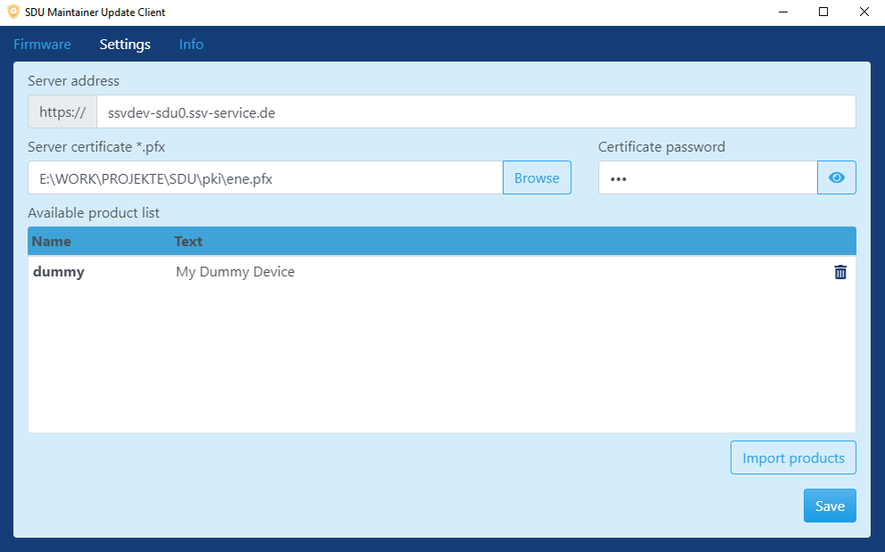
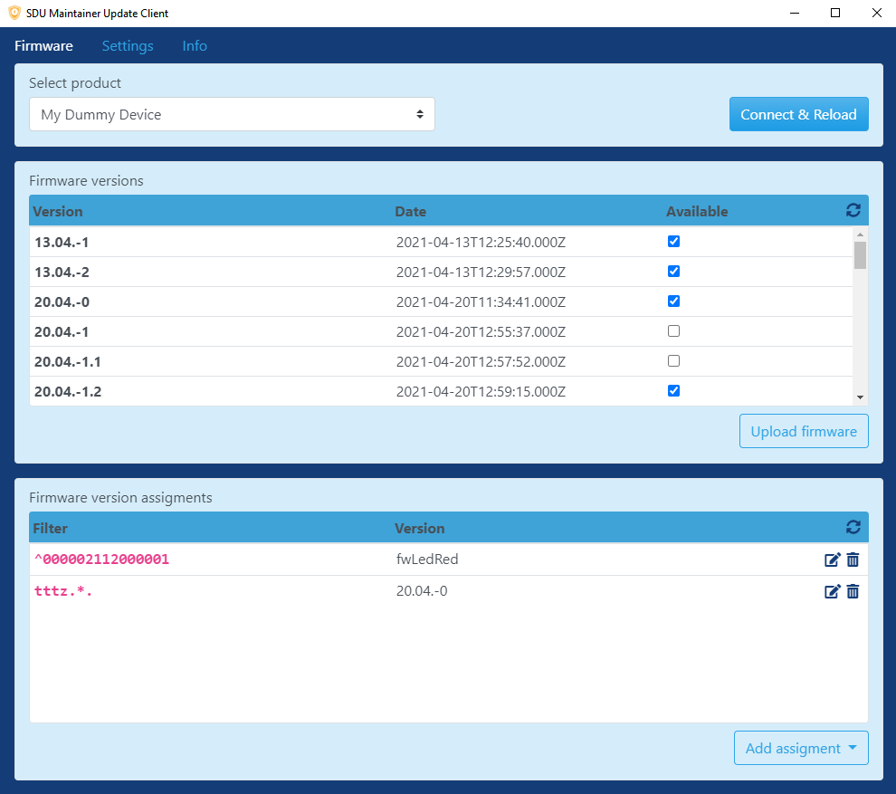

# SDU Maintainer Tool

Ist ein Windows Tool zum hochladen der Software ([SDU-Archive](sdu-signing-tool.md)) auf den SDU-Server und zur Verwaltung/Verteilung dieser. Das Tool bedient sich der [REST API](https://github.com/SSV-embedded/SDU-API).

## Benutzung
### Installation
- Tool herunterladen und installieren. [SDU Management Tool Setup 4.0.0.exe](https://hidrive.ionos.com/lnk/VYiMgIBD)
- Die Anwendung `SDU Management Tool` starten
### Konfiguration
- Produktliste erstellen. Beispiel Datei mit einem Produkt:  
`my-products.json`:
	``` json
	{
		"products": [
			{
				"name": "dummy",
				"text": "My Dummy Device"
			}
		]
	}
	```
	- `name`: Produkt Name nach JavaScript [Kodierungskonventionen](https://de.wikipedia.org/wiki/Namenskonvention_(Datenverarbeitung))
	- `text`: In den Tools angezeigter Produkt name. Frei definierbar.

- Im Programm unter **Settings** 

	- SDU-Server Adresse eintragen.
	- Zertifikat für die Kommunikation mit dem Server auswählen und dazugehöriges Passwort eintragen.
	- Die erstellte Produktliste importieren.

### Firmware verwalten

- Firmware hochladen. Projekt auswählen, eine signierte Firmware hochladen und aktivieren
- Firmware einem/mehreren Gerät/en zuweisen durch anlegen eines **Assignments**. Der Filter ist ein Regulärer Ausdruck und wird von oben nach unten abgearbeitet.
