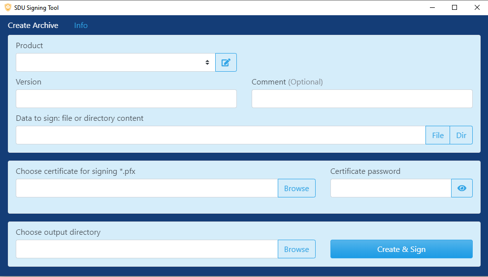

# SDU Signing Tool

Ist ein Windows Tool zum verpacken und signieren der Firmware zu einem SDU-Archive mit der Endung `*.sdu`. Dieses Archive kann von dem [SDU Maintainer Tool](sdu-maintaner-tool.md) auf den SDU-Server geladen werden.

## Benutzung
### Installation
- Tool herunterladen und installieren. [SDU Signing Tool Setup 4.0.1.exe](https://hidrive.ionos.com/lnk/U3ITfC9AL)
- Die Anwendung `SDU Signing Tool` starten

### Konfiguration

- Unter **Product** die [Produktliste](sdu-maintainer-tool.md) importieren.
- Zertifikat für die Signierung auswählen und dazugehöriges Passwort eintragen.
- Verzeichnis auswählen wo das erstellte SDU-Archive abgelegt werden soll.

### SDU-Archive erstellen
- Produkt auswählen.
- Version und optional ein Kommentar vergeben.
- Inhalt des SDU Archive hinzufügen mit **File** oder Inhalt eines Verzeichnisses mit Dateien mit **Dir**.
- Archive erstellen und signieren mit **Create & Sign**.
